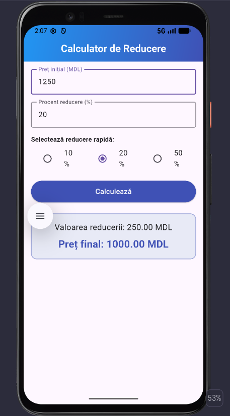

# Discount Calculator App



## Overview

Discount Calculator App is a simple, cross-platform mobile application built with Flutter that
calculates the final price of a product after applying a discount.

## Features

- **Price Input**: Enter the initial price of a product.
- **Discount Input**: Enter a custom discount percentage manually.
- **Quick Discount Presets**: Instantly apply common discount values (10%, 20%, 50%) using radio
  buttons, without typing them manually.
- **Instant Calculation**: Calculate the discount amount and the final price with a single tap.
- **Result Display**: Clearly displays both the discount amount and the final price after
  calculation.
- **Clean Architecture**: UI, business logic, and data models are separated into dedicated files
  for readability and maintainability.

## Technologies

- **Framework**: Flutter
- **Language**: Dart
- **UI Toolkit**: Material Design 3
- **Development Tools**: Android Studio
- **Version Control**: Git, GitHub

## Project Structure

```
lib/
├── main.dart                              
├── app.dart                              
├── models/
│   └── discount_result.dart               
├── services/
│   └── discount_calculator.dart           
├── pages/
│   └── discount_calculator_page.dart      
└── widgets/
    ├── price_input.dart                  
    ├── discount_input.dart                
    ├── preset_percent_selector.dart       
    ├── calculate_button.dart              
    └── discount_result_card.dart         
```

## Resources

- [Learn Flutter](https://docs.flutter.dev/get-started/learn-flutter)
- [Write your first Flutter app](https://docs.flutter.dev/get-started/codelab)
- [Flutter learning resources](https://docs.flutter.dev/reference/learning-resources)
- [Flutter Documentation](https://docs.flutter.dev/)

## Installation

To install and run the application, follow these steps:

1. **Clone this repository:**
```bash
git clone https://github.com/Constantin-Stamate/discount-calculator-app
```

2. **Navigate to the project directory:**
```bash
cd discount-calculator-app
```

3. **Install dependencies:**
```bash
flutter pub get
```

4. **Run the application:**
```bash
flutter run
```

## Contributors

**Discount Calculator App** was developed as part of the Mobile Application Development
laboratory works.

- GitHub: [Constantin-Stamate](https://github.com/Constantin-Stamate)
- Email: constantinstamate.r@gmail.com